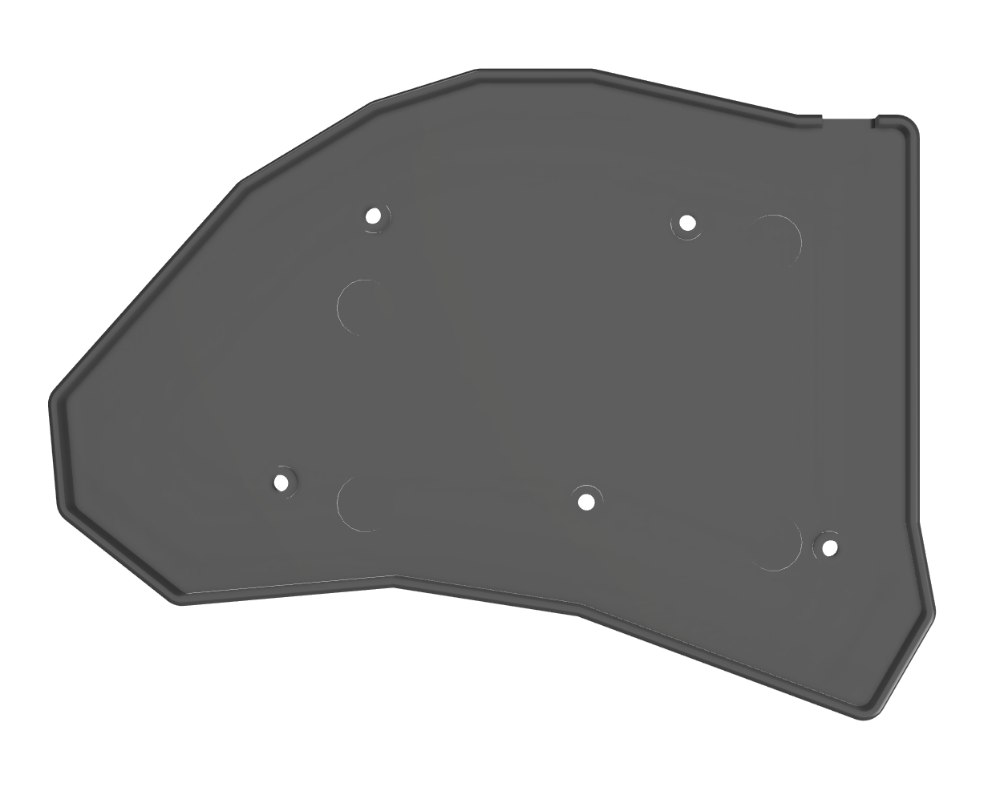

# 3d printed keyboard case

Designed to hold 4 10x1mm magnets to hold the two halves together for transport.

## Preview

| | |
|  | [front](../../images/case_front.png) |

## Printing

- layer height: 0.2mm
- wall thickness: 0.8mm
- infill: doesnt matter
- supports: not needed