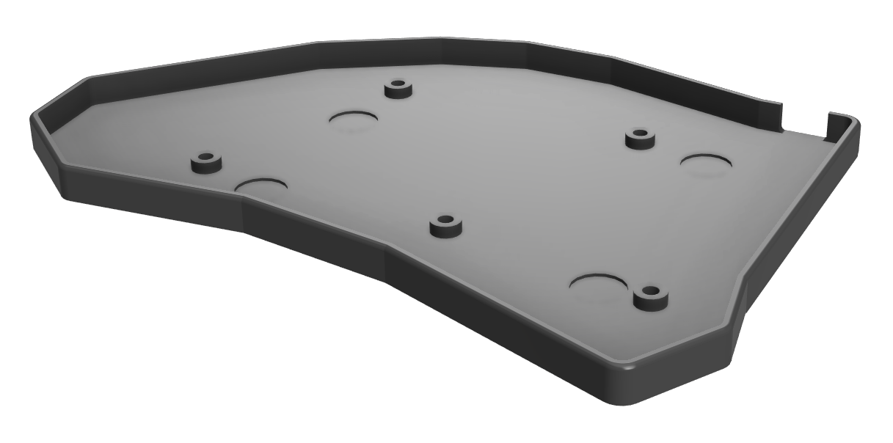

# 3d printed keyboard case

Designed to hold 4 10x1mm magnets to hold the two halves together for transport.

## Preview

| Top | Front |
|-----|-------|
|  |  |

## Bill of Materials

| Item | Count | Note |
|------|-------|------|
| Printed case left + right | 1 | |
| Magnets | 8 | round, 10x1mm |
| Screws | 10 | M2*6 |
| Threaded inserts | 10 | M2*3 |
| Silicone feet | 8 | |

## Printing

- layer height: 0.2mm
- wall thickness: 0.8mm
- infill: doesnt matter
- supports: not needed
