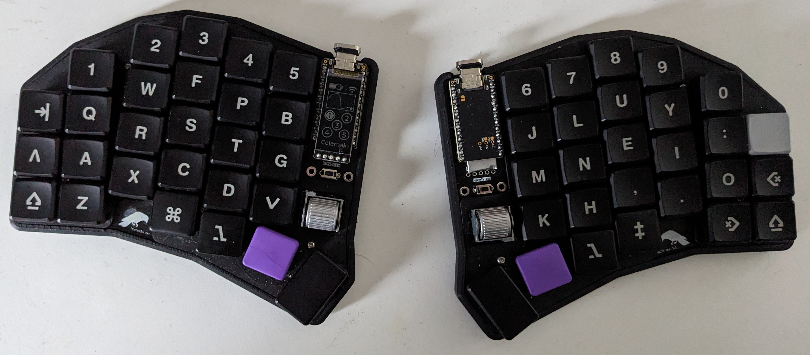
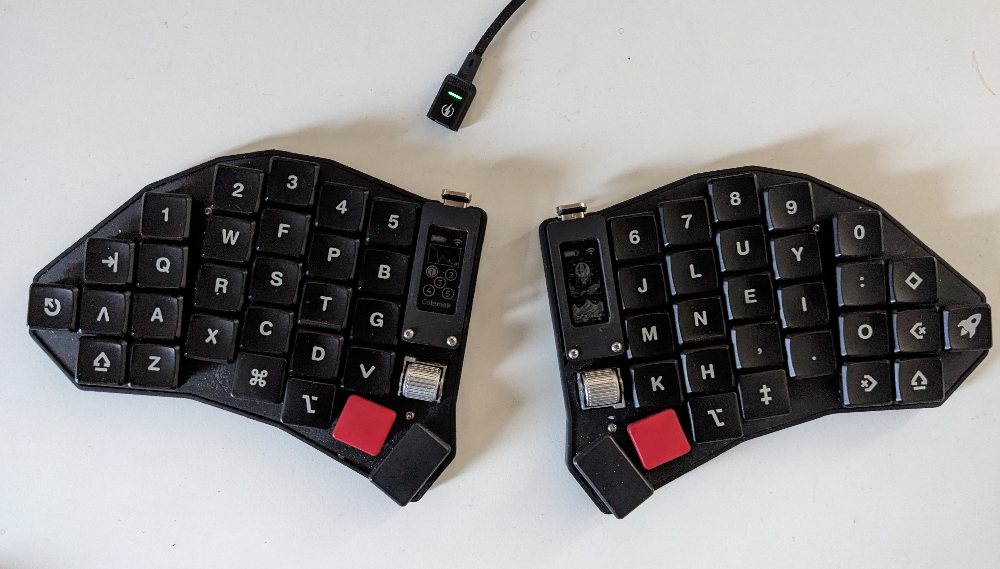
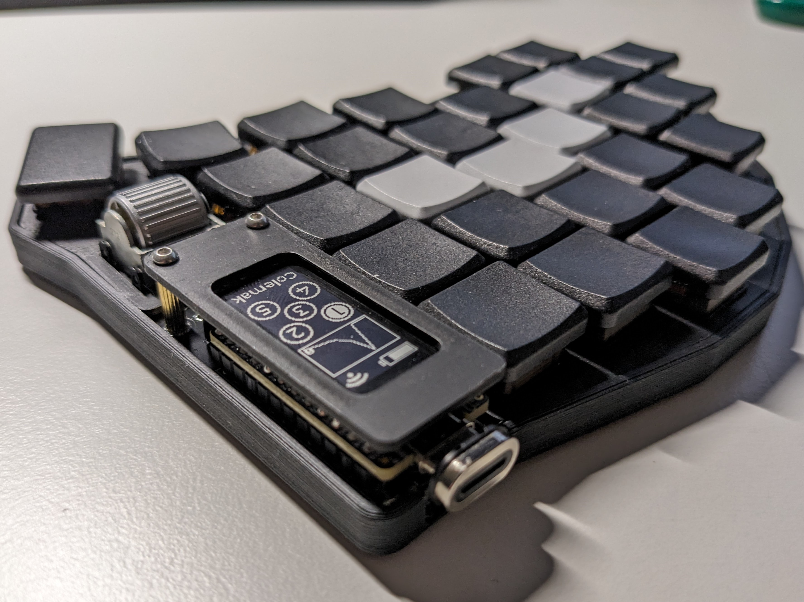
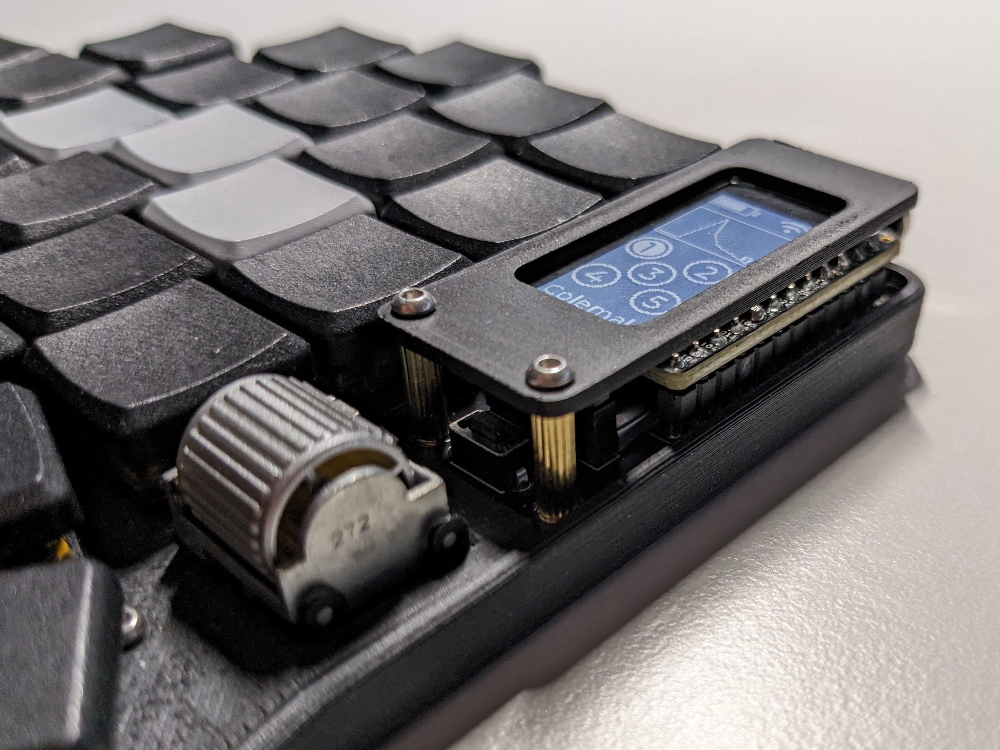
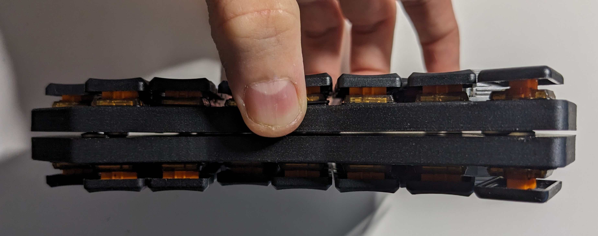
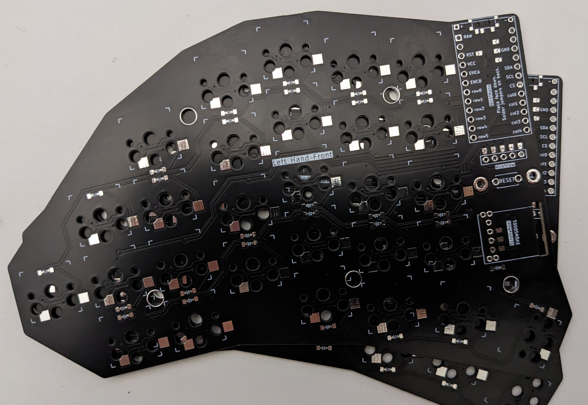

# Corax: A column-staggered fully-wireless split keyboard with scrollwheels.

- Choc-spaced, hot-swappable
- Two versions: with 56 or 54 keys
- Scrollwheel (EVQWGD001) on both sides
- Strong pinky stagger (0.66) and a 5 deg. pinky splay
- Fully wireless built for Nice!Nano + ZMK (no TRRS Jack)
- Nice!View support (5 pin connector)
- Reversible PCB
- 3d printable magnetic case, switchplate and MCU cover 

## Gallery

## Corax56 vs Corax54

I initially designed the Corax56 (=56 keys) with 4 pinky keys. The upper key (usually mapped to ESC) was placed in a new column because I found it easier to reach horizontally than vertically.
Over the time, I realized that I am not using this button very often. The Corax54 was born as a more compact version where the pinky cluster misses this additonal column and has only 54 keys (2 less). This is the only difference between the two versions.

## Firmware

Natively supports [ZMK](https://zmk.dev/). The firmware for the Corax56 and Corax56 can be found in the submodule and is available here: https://github.com/dnlbauer/corax-zmk-config

## Build guide

[see here](./docs/BuildGuide.md)

## Standing on the shoulders of giants

- A great tutorial I referenced a lot by FlatFootFox: https://flatfootfox.com/ergogen-introduction/
- Lots of inspiration and ideas for this project came from these boards: [Choccy](https://github.com/sprengboard/choccy), [Sofle](https://github.com/josefadamcik/SofleKeyboard), [brain](https://github.com/Wesztman/brain), [spleeb](https://github.com/chrishoage/spleeb)

## License

This project is licensed under the MIT License - see the [LICENSE](LICENSE) file for details.
