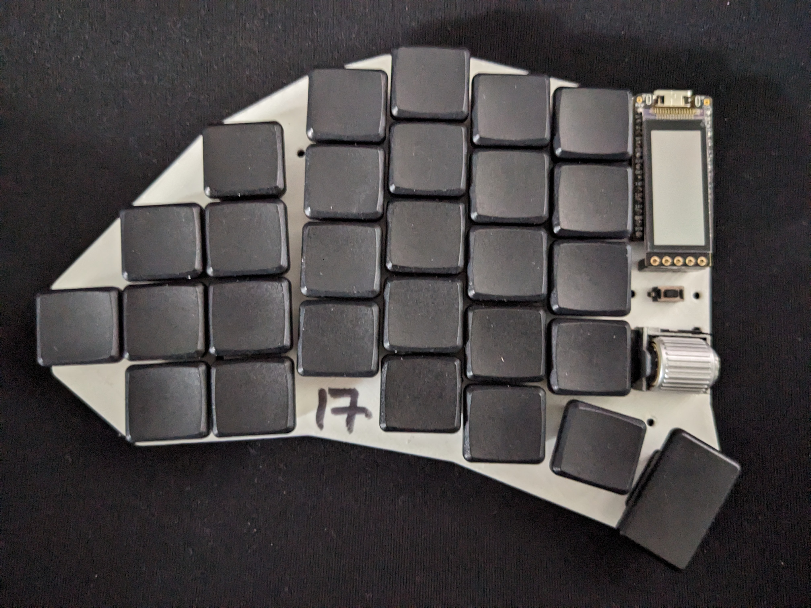

# Project: Build a keyboard

!! This is a work-in-progress !!

-> [schematics](docs/schematic.md)

## Preview

## Features

- Choc-spaced, hot-swappable
- 56 keys (4 thumb keys, 4 key pinky cluster)
- Scrollwheel (EVQWGD001) on both sides
- Strong pinky stagger (0.66) and a 5 deg. pinky splay
- Fully wireless built for Nice!Nano + ZMK (no TRRS Jack)
- Nice!View support (5 pin connector)
- Reversible PCB
