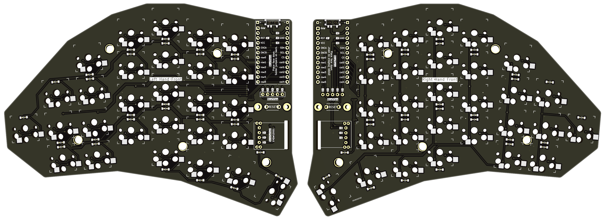
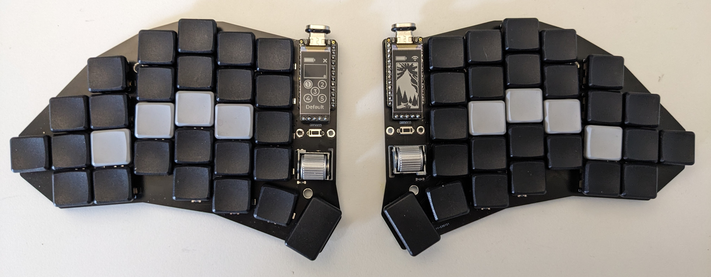
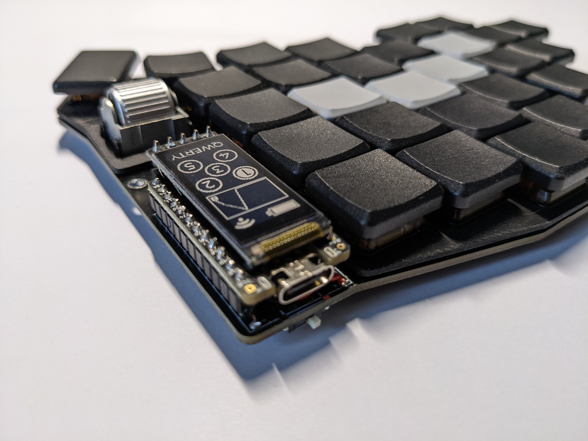
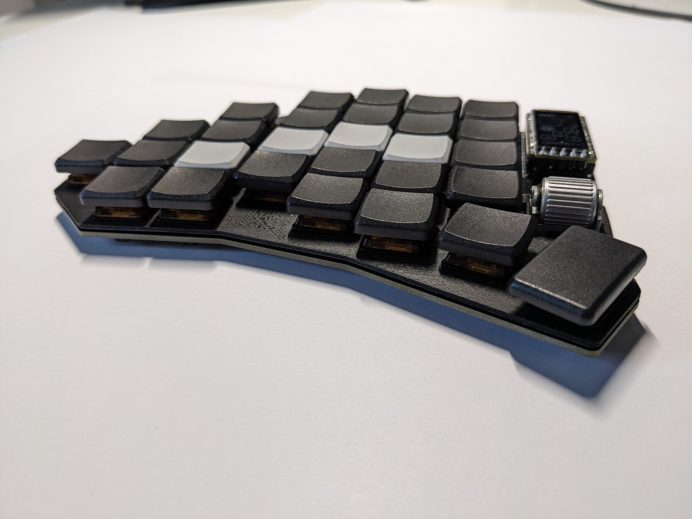

# Project: Build a split keyboard

**⚠ This is still a work-in-progress ⚠**

A 56 keys column-staggered fully-wireless split keyboard with scrollwheels.

## Features

- Choc-spaced, hot-swappable
- 56 keys (4 thumb keys, 4 key pinky cluster)
- Scrollwheel (EVQWGD001) on both sides
- Strong pinky stagger (0.66) and a 5 deg. pinky splay
- Fully wireless built for Nice!Nano + ZMK (no TRRS Jack)
- Nice!View support (5 pin connector)
- Reversible PCB

## Gallery

## Bill of materials
**Essentials**:
| **Item**                        | **Count** | **Note** |
|---------------------------------|-----------|----------|
| Keyboard PCB                    | 2         |          |
| Nice!Nano                       | 2         |          |
| 12 pin headers and sockets      | 4         | You can use through-hole diode legs as pins. Sockets spacing: 2.54mm, Socket height: Using minimal height sockets might not leave enough room to mount the battery under the MCU. 3DS1002-01-1*20V13-JK by CONNFLY are a good choice, but you can also use lower ones and longer legs instead. Spiltkb has a good [guide on mounting](https://docs.splitkb.com/hc/en-us/articles/360011263059).  |
| LiPo battery (301230)           | 2         | 110mAh   |
| Kailh Choc v1 switches (PG1350) | 56        |          |
| Keycaps                         | 56        |          |
| Kailh Choc hotswap sockets      | 56        |          |
| Encoder EVQWGD001               | 2         |          |
| Diodes 1N4148W                  | 58        | for each key + encoder |
| Buttons                         | 2         | reset buttons; 2 pins through-hole, tactile, 3x6x4.3mm |
| Slider Switches                 | 2         | on/off switches; SMD, C128955 |
| USB-C Cable                     | 1         | for copying the firmware 

**Optional**:

| **Item**                        | **Count** | **Note** |
|---------------------------------|-----------|----------|
| Nice!View + mounts              | 2         |          |
| Switchplate                     | 2         | Height: 1.2mm; either 3d printed or cut pcbs |
| Silicone feet                   | 8         |          |

## Firmware

Only supports ZMK. The firmware repository can be found here: [https://github.com/dnlbauer/splitkeyboard-zmk-config](https://github.com/dnlbauer/splitkeyboard-zmk-config).

## Build guide

TODO

## TODO List
- [ ] Increase diode-socket distance.
- [ ] Fix MCU pin labels on right-front (Some are mirrored / not on the correct side of the MCU).
- [ ] Give this project a **name**.
- [ ] Design a case.
- [ ] Use github actions to build + release gerber files.