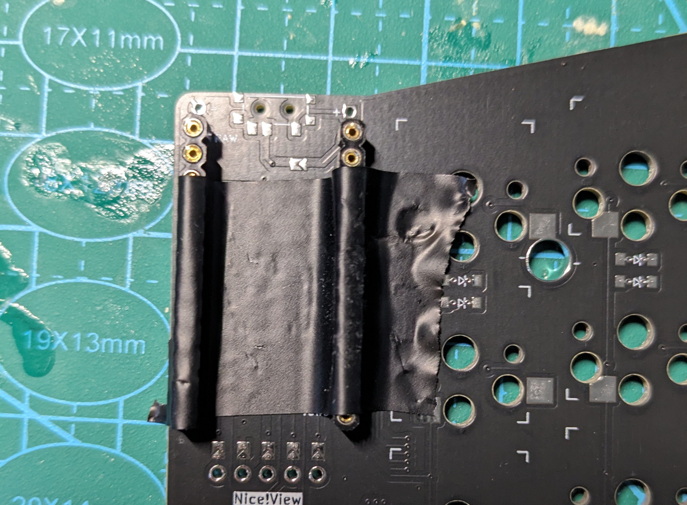

# Build Guide

This guide describes the process of building the Corax54. For the Corax56, the build process is very similar and this guide should be easy to adopt to it.

Disclaimer:
This guide is written from the perspective of someone who already build some keyboards. It is probably not very beginner-friendly. There are many tricks and techniques for soldering and assembling keyboards that are not covered in detail. If this is your first build, I strongly recommend reading one or two more comprehensive guides on other keyboards that offer more detailed instructions first. Doing so will help you to avoid common pitfalls. A great guide I can suggest is the one for the sofle: 
https://josefadamcik.github.io/SofleKeyboard/build_guide_choc.html

## Ordering PCBs

To order the PCBs, grab the relevant zip file with the gerber files from the [releases page](https://github.com/dnlbauer/corax-keyboard/releases) (named corax*-gerbers.zip) and send them to the PCB etching service of your choice. I personally can recommend [JLCPCP](https://jlcpcb.com/). I recommend these settings:

|||
|-------------------------|---------------------|
| Layers                  | 2                   |
| PCB Thickness           | 1.6 mm              |
| Surface Finish          | LeadFree HASL       |
| Via Covering            | Tented              |
| Board Outline Tolerance | +/- 0.2 mm(Regular) |

## Buiding the Keyboard

You need two pcbs: for the right and left hand side. Make sure to not mix them up during the build process. If this guide says "front side" and you are building the left hand side of the keybaord, you are meant to work on the side that says "Left Hand Front" on it. In this caes, the side saying "Right Hand Front" is considered to be the back side. 

A good strategy is to mark the intended front side of each side with a post-it or a piece of tape. Before each step, make sure you are working on the correct side to not mess things up!

### Jumper

There are 12 Jumpers on each side of the board. They make the MCU pin holes reuseable for the left and right version. You need to solder the pins **ONLY on the back of the pcb**. I.e if you are working on the left side of the keyboard, the front side is labeled "Left Hand Front" and you are required to only solder the jumpers on the side that is labeled "Right Hand Front". This is crucial! If you solder the pins on the wrong side, the keyboard will not work (and you might even short the MCU and break it!).

Solder all jumpers circled in red. There are a total of 12 jumpers at 3 positions for the MCU, display and the scrollwheel.

### MCU sockets

Solder in the MCU sockets. I usually tape them into position, then flip the board and solder them while the tape holds them in place.

Here you can see the back side with the sockets soldered in place and the soldered jumpers:

### On/Off switch and reset button

The On/Off switch belongs to the back side of the board to leave enough room for the battery between the MCU and board. It has 7 legs, but only the 3 marked legs are required for the board to work. If you want, you can also solder the other pins of the switch; it doesn't matter.

The 2-pin reset button can now be soldered too. Put it in from the front side and solder on the back. The orientation does not matter.

### Scroll wheel

Before soldering, you need to cut away at least the one foot on the left of the scrollwheel in the picture below. It is not needed and there is no hole for it on the board.

I also cut away the overhangs on the long right edge to make it easy to place the scrollwheel on the board. The soldered pins should be sturdy enough to hold the scrollwheel in place without the overhanging bits. There is a risk of breaking one of the pins otherwise because it is a very tight fit.

### Hotswap socket and diodes

There are a total of 54 hotswap sockets and 55 diodes (one for each key + scrollwheel) per side. Both belong to the **back side** of the board. For the diodes, the orientation is important! Each diode has a marking (an arrow or a white line) that must be oriented towards the pointy arrow that is shown on the board. If you are unsure, google how to place diodes first and get used to the terminology first!

Image of the back and front side with all components in place:

### Battery

Now it is time to add the LiPo battery. It is intended to be placed on the front side below the MCU, but in theory, it is also possible to add it to the back side. Just make sure the polarity matches the markings on the front side of the board. Usually, black means (-) and red means (+).

### MCU

Add the MCU and solder the pins to it. The MCU belongs to the front side facing down. If you bought the correct sockets, there should be enough room to hide the battery under it. If there is not enough room, solder the pins in such a way that there is enough room below.

### Add switches and keycaps

## Display (Nice!View)

TODO

## 3d printed Case

TODO
